# Automating A Visual Test

The purpose of this document is to explain, in detail, how to code a visualization test.

For general information regarding Visualization testing, please see the [following page](https://confluence.lampsplus.com:8093/display/TA/Automated+Visual+Testing) in Confluence.

### The Visualization Project and Folder Structure

Visualization tests have been given their own project in Visual Studio: **LampsPlus.VisualRegressionTests**. The folder structure is identical to what is found in the LampsPlus.RegressionTests project: Tests that have both a desktop and mobile variant will be placed inside the appropriate folder within the '**Common**' folder. If a test **ONLY** exists for Desktop **OR** Mobile, it will be placed in the '**Desktop**' or '**Mobile**' folder.

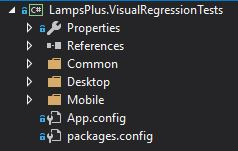

The name of the Jira task will indicate which main folder the test belongs to. For instance, a task titled "LP-T7398 and LP-T7399: Verify the layout of the Print Preview, Create Account modal, and Linc widgets on the Order Confirmation." indicates that this test belongs in the 'Common' folder because there are 2 Adaptavist test case IDs. A task with only one ID will belong in either the 'Desktop' or 'Mobile' folder; actually looking the test up in Adaptavist will tell you which.

### Disabling vendor's visual captures taking during troubleshooting/debugging of the functional part of the visual test.

During troubleshooting of functional part of the visual test, taking visual captures is not required. As the number of captures provided by the vendor is limited, it is **strongly recommended** to disable captures during troubleshooting/debugging of the functional part of the visual test.
t will also allow to mitigate visual test's troubleshooting by detecting if the test's failure belongs to the functional part of the test only.
Captures can be disabled by providing value "false" at visual assembly's app.config "AreApplitoolsCapturesOn" parameter.

### General Test Case Format
In general, the format of a visualization test case is very similar to how regression tests are formatted. For example:
* There will still be a DesktopBase and a MobileBase (for 'Common' folder tests). 
* Each device configuration will need to be its own class.
* Abstraction will be used for differing implementations between desktop and mobile.

Basically, the standards laid out in '**Test Class Standards.md**' in the Documentation/Design Requirements folder still apply.

There are several important differences, however: 
* **EVERY** test class **MUST** have at least **TWO** inline data configurations.
* **EVERY** visualization test will be initialized with the method **InitializeVisualTest()**.
* **EVERY** visualization test's base will inherit from **VisualTestsBase** and **IClassFixture\<TFixture>**.

#### Inline Data Configurations
Each visualization test must have _at least_ two inline data configurations because a baseline screenshot must be taken so another screenshot can be compared against it. Since we want the test to run twice in succession, the way to do this is use two inline data test configurations:

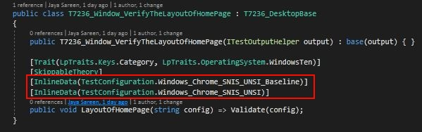

Notice the inclusion of the word '**Baseline**' at the end of the first test config. These configurations have already been created. However, if there is a configuration that does not exist, it must be added to the class file **\LampsPlus.AutomationFramework\Utilities\TestConfiguration\TestConfiguration.cs**

There are cases where there will need to be more than two inline data configs added to a test. Currently, the only device that requires this is the iPhone. This is because the regular iPhone has a screen width of 375 and the Plus models have one of 414. This is handled by adding the word "**SecondaryViewPortWidth**" to the test configuration as seen below:

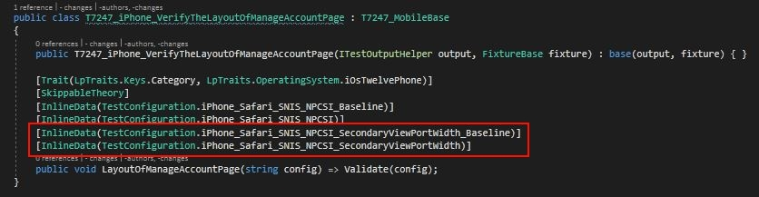

Nothing else needs to be done; all of the actual size configurations have been setup in the framework.

#### The InitializeVisualTest() Method

There are already different ways to initialize tests in the automation framework. Regular regression tests are initialized using **InitializeFramework()**. Certona tests are initialized using the **InitializeCertonaFramework()** method.

Visualization tests also have their own initialize method: **IntializeVisualTest()**. 

**ALL** visualization tests will use this initialize. This initialize sets up all the necessary functionality to successfully execute a test which requires screenshots to be captured for comparison.

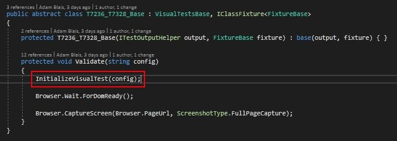

#### Visual tests Validate() method has an extra parameter.

The way we call the global Validate() method in the visual tests **differs** from the functional tests.  Visual tests first call the VisualTestsBase.cs Validate() method, which then calls the test's Validate() method via an Action delegate parameter (please see an example below).

This setup is required to control the visual test baseline results in the VisualTestsBase.cs Validate() method:

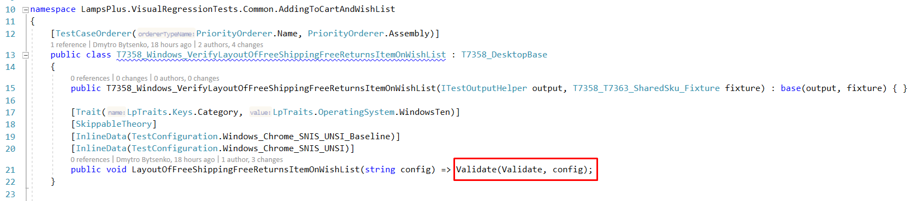

#### Inheritance In A Visual Test

In regular regression tests, the main base class tends to inherit from a closely associated TestsBase as seen here:

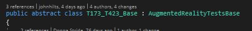

In the example above, the test case T173_T423 is an Augmented Reality test case and therefore, the base inherits from **AugmentedRealityTestsBase.cs**. This pattern is followed for other regression tests: a Product Detail test case would inherit from **ProductDetailTestsBase.cs**, a Payment test case would inherit from **PaymentTestsBase.cs**, and so on.

The difference with Visualization tests is the test case base class will **ALWAYS** inherit from **VisualTestsBase** and the interface **IClassFixture\<TFixture>**:

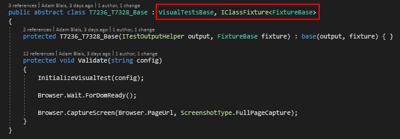

 The **ONLY** exception to this is the value of the **TFixture**: When shared data is required for a test, the value between the \<> will change from **FixtureBase** to another value. This is explained in detail in the section "**Using Common Data In A Test**".

Please make sure to update the constuctor accordingly and add the **FixtureBase** class and **fixture** parameter:

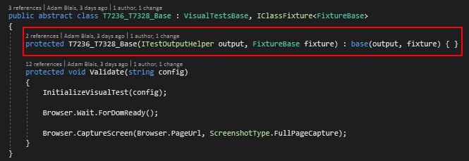

Again, this format is slightly different when using shared data further explained in the section "**Using Common Data In A Test**".

### The Test Environment.txt File
In conjunction with using two inline data test configurations, there must also be TWO environments defined in the '**Test Environment.txt**' file located in the **LampsPlus.AutomationFramework** project in Visual Studio. The environments are separated by a comma:

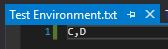

The important point to remember about this file is that the **first** environment listed is the **non-Baseline** environment and the **second** environment listed is the **Baseline**.

So, for example, if a person wanted to use Instance D as the Baseline and Instance A as the comparison environment, the Test Environment text file would be set up as "**A,D**".

_**NOTE:** The above is the reason why you **MUST** have the docker installed and set up on your machine prior to working on a visualization test. Without it, it is impossible to use the proxy locally and test against two separate environments at the same time._

Please also keep the following in mind: Testing a non-Visualization test still makes use of the Test Environment text file. However, since a normal regression test does not make use of Baseline inline data configurations, make sure that the environment variable needed for the test is the **FIRST** value in the text file.

So, for example, if a user needs to test a normal regression test on Instance B, the Test Environment text file would be set up as "**B,D**".

---

### Taking A Screenshot
There are three different types of screenshots that are available for visualization testing:
* The **visible screen only**. This is the screen that is visible without any kind of scrolling:

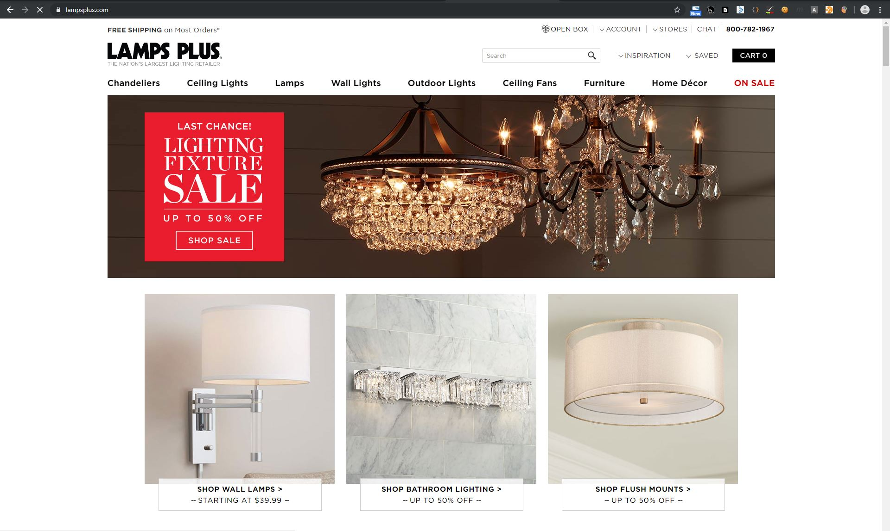
* The **entire page**. This is the entire page from top to bottom. Applitools has the ability to scroll and capture screenshots then stitch them together to form a complete image:

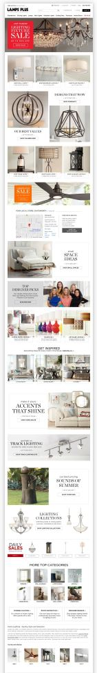
* A particular **element**. This is a focused screenshot of a defined element like a menu or modal:

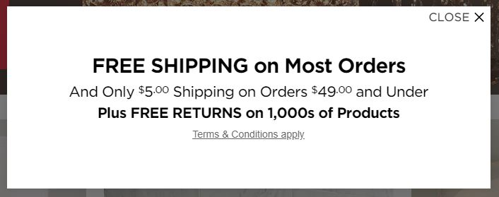

The language in the visualization test cases in Adaptavist is very particular and indicates which type of screenshot is required.
* A **visible screen** screenshot - "_Capture a screenshot of the entire visible screen._"
* An **entire page** screenshot - "_Capture a screenshot of the entire page._"
* A particular **element** screenshot - "_Capture a screenshot of the **\<ELEMENT TYPE>** element._" where **\<ELEMENT TYPE>** could be 'menu', 'modal', etc.

---

### Taking An Entire Page Screenshot
*See Test Case T7246_T7247_VerifyTheLayoutOfManageAccountPage.cs for an example of this implementation.*

After reaching a point in a test where a screenshot needs to be taken of the entire page, add the following line of code: **Applitools.CaptureScreen(Browser.PageUrl, ScreenshotType.FullPageCapture);**

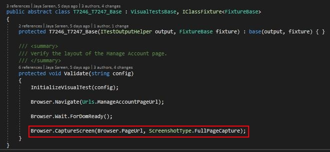

---

### Taking A Visible Screen Screenshot
*See Test Case T7231_T7244_VerifyTheLayoutOfHeaderMenus.cs for an example of this implementation.*

Taking a screenshot of the visible screen is almost identical to taking an entire page screenshot. Just change the value after **ScreenshotType** from FullPageCapture to **VisualAreaCapture**:

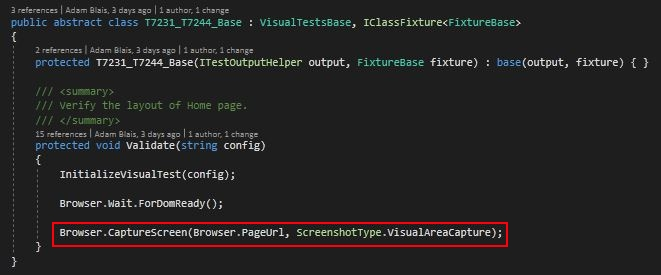

---

### Taking An Element Screenshot

Taking a screenshot of just a particular element is very straightforward. There is a method located in the **Browser** class called '**CaptureElementArea**'. There are two parameters that are passed into this method: the current page URL, and the **IElement** of the desired element that needs to be included in the screenshot. 

  So, for example, if a user wished to capture a screenshot of _just_ the Shipping modal on the Cart Overview page, the code would look something like this: **Applitools.CaptureElementArea(Browser.PageUrl, CartOverview.ShippingOptionModal)**.

  _NOTE: There is a high probability that the element that needs to be captured has already been defined in the appropriate page object model. Please make sure that it does not exist before creating a new IElement._ 

   Please see below for a step by step instruction on how to capture an element only screenshot.

1. Using the example from above, if a test case requires a screenshot of the Shipping Options modal, first the actual element needs to be defined in a page object. In the screenshot below, the desired element is shown to have an id of '**selectDeliveryOptionsModal**':

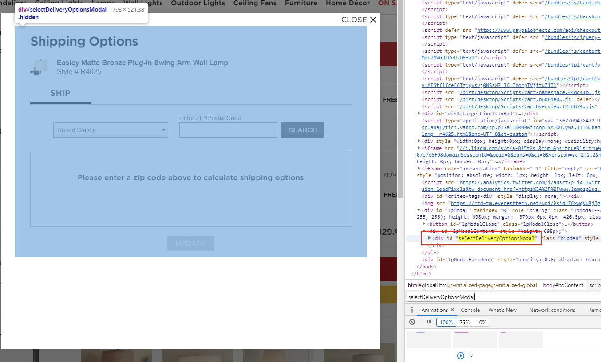

2. Verify if the element is in the framework. In this case, it does indeed already exist within the **ShoppingCartBase** class:

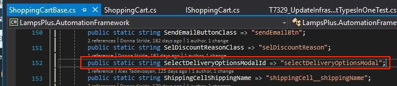

3. By following the reference of the Id, the user is brought to the IElement implementation of the modal element:

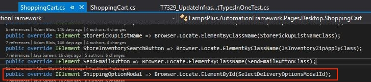

4. In the appropriate section of the test class, call the **Applitools.CaptureElementArea()** method and pass in the current page URL plus the IElement. Remember to include the page object before the actual IElement. In this particular example, the correct code for capturing the element would be **Applitools.CaptureElementArea(Browser.PageUrl, CartOverview.ShippingOptionModal)**:

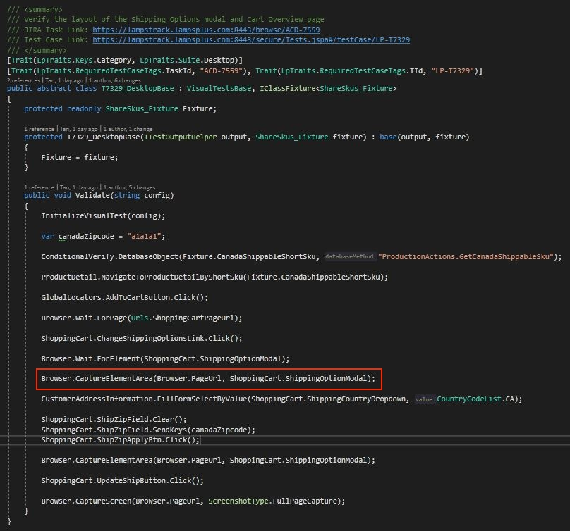

---

### Taking A Screenshot of A Modal That Has A Scrollbar
*See Test Case T7361_T7362_VerifyLayoutOfShippingPage for an example of this implementation.*

There are cases where a modal screenshot needs to be taken, but the modal itself has more content than can reasonably fit in the visible area thus requiring the user to scroll in order to see it. This frequently happens on mobile test cases particularly in the order flow. Fortunately, there is a screenshot capture method to account for this.

1. As an example, the **Edit Payment Details** overlay on the Payment page in mobile clearly goes off the screen:

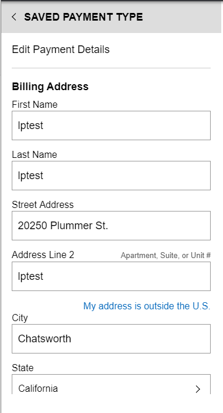

2. The first step needed is finding the locator that encompasses the entire content required for the screenshot. This can be particularly tricky for these types of screenshots because the necessary locator tends to be buried in div layers within the HTML. In this particular case, the locator needed, "lpScrollContainer", is only three layers deep. Notice how the green border goes off the screen indicating that there is more content below:

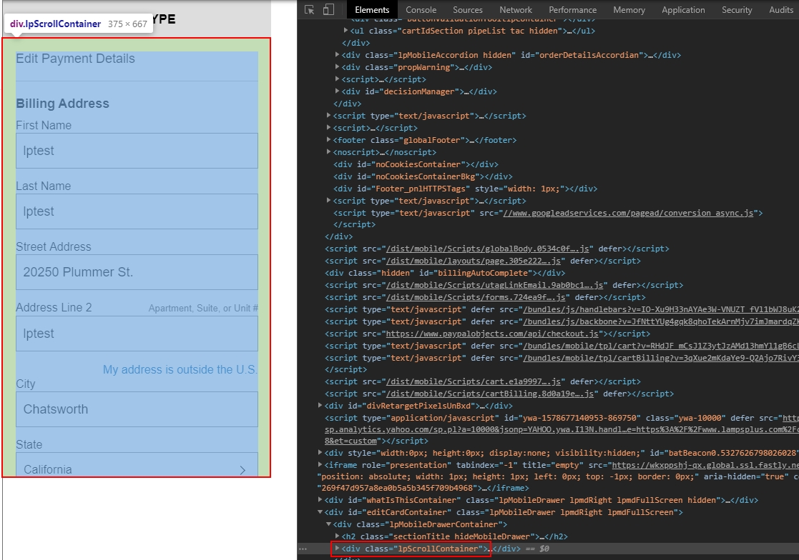

3. Once the proper locator has been identified, however, the process for taking the screenshot is exactly the same. The only exception is the name of the method that is used: **Applitools.CaptureWholeOverlayModal**. As the parameters, pass in **Browser.PageUrl** and the IElement that was defined in the POM from the  locator that was identified in step 2 (in this case "lpScrollContainer" which was used to created the IElement **Payment.EditPaymentDetails**):

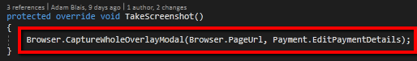

4. After the test runs and Applitools stitches together the screenshot, check in Applitools to see the result:

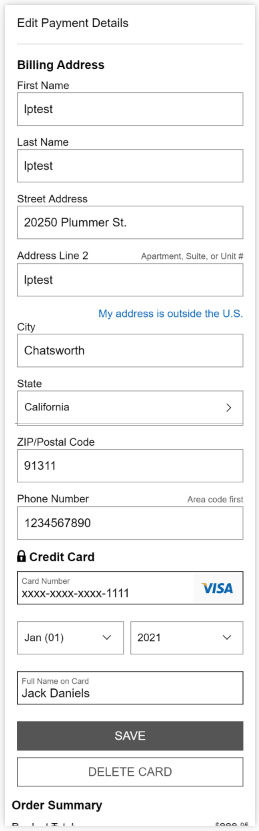

**NOTE:** In the screenshot above, notice that the Order Summary is showing beneath the **Delete Card** button which is technically the bottom of the overlay. Unfortunately, because of the way the overlays work for mobile on Lamps Plus, it is entirely likely that there will be a little bit of additional content after the end of the modal that is trying to be captured. This is fine. What's more important is that the entire modal content is captured to fulfill the requirements of the test case.

### Taking An Entire Page Screenshot AND Visible Screen Screenshot In the Same Test
*See Test Case T7269_T7294_VerifyLayoutOfProsSpecialPriceCallout.cs for an example of this implementation.*

There may be a case where for Desktop, a screenshot is only needed for the visible screen, but for Mobile, the entire page is required. This can be achieved by using abstraction.

1. In the test class Base, instead of passing in the parameter **ScreenshotType.FullPageCapture** or **ScreenshotType.VisualAreaCapture**, pass in a descriptive method name for capturing a screenshot. In the case below, **GetScreenshotType()**:

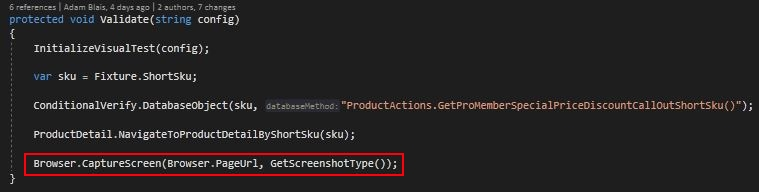

2. Create a protected abstract method **GetScreenshotType()** of the enum **ScreenshotType**:

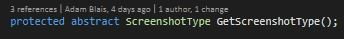

3. In the DesktopBase, override the method and, if Desktop requires a visible screen screenshot, have it return **ScreenshotType.VisualAreaCapture**:

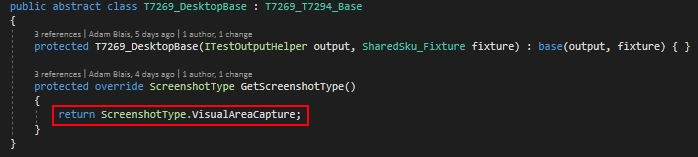

4. In the MobileBase, override the method and, if Mobile requires an entire page screenshot, have it return **ScreenshotType.FullPageCapture**:

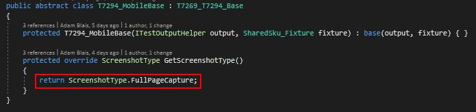

---

### Ignoring A Particular Element In A Screenshot

There are certain elements on the Lamps Plus site that are dynamic and will _always_ be different between test executions. One such element, for example, is the **CartId** located on the Cart Overview page. Each time a test is executed, even if the same exact product is added to the cart, the CartId will be different every time. As a result, any screenshot comparison will fail.

However, there is a way to ignore specific elements in a screenshot. This process is outlined below.

1. When reaching a point in a test where a screenshot needs to be captured but have a particular element ignored, the proper method to use is **Applitools.CaptureScreenWithIgnoreElement()**. There are three parameters that must be passed in to the method: the **current page URL**, the **regionElement**, and the **elementToBeIgnored**.

2. Before actually calling the Applitools.CaptureScreenWithIgnoreElement() method, the regionElement and elementToBeIgnored must be defined. Use local variables with descriptive names and have the values be the IElements of the 1) region that contains the element to be ignored and 2) the actual element to be ignored.

  In the example below, the **cartOverview** variable is the element that contains the actual CartId element, **cartIdElement**:

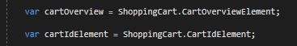

   As seen below, the CartId is part of the class "**cartContent**":

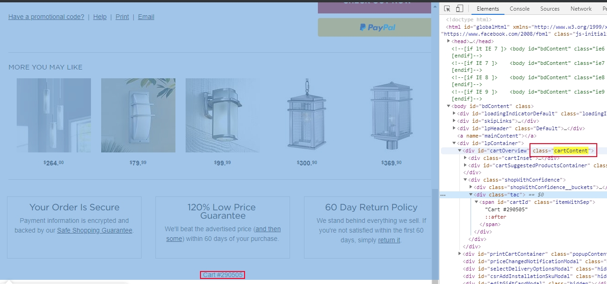

   This is then defined as a string in the ShoppingCart page object model:

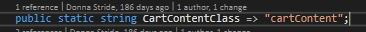

   And then finally an IElement is created based on this string:

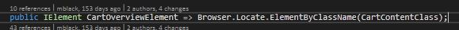

   Hence, the local variable in the test case is now set to **var cartOverview = CartOverview.CartOverviewElement;**. Follow the same process to define the actual CartId. _NOTE: Rarely should new IElements need to be created - they should already exist in the page object models. Please be careful to not create duplicate locators._

3. After the regionElement and elementToBeIgnored local variables have been set, it is just a matter of passing them into the Applitools.CaptureScreenWithIgnoreElement() method in the correct order. This order is **Applitools.CaptureScreenWithIgnoreElement(Browser.PageUrl, regionElement, elementToBeIgnored);** So, using the elements above, the method call would look like:

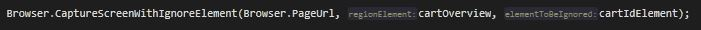

_NOTE: During the Visualization test creation process, the following elements will need to be ignored when comparing screenshots: **CartId**, **OrderId**, and, in some cases, **Email Addresses**._

---

### Ignoring Multiple Elements In A Screenshot

In rare circumstances, it may become necessary to ignore multiple regions on a page. 

1. In order to capture a screenshot with multiple ignored elements, the proper method to use is **Applitools.CaptureScreenWithIgnoreElements()**. There are three parameters that must be passed in to the method: the **current page URL**, the **regionElement**, and a _**LIST**_ of **elementsToBeIgnored**.

2. Just like with ignoring one element, a region must first be created which encompasses all the elements to be ignored. In the example below, the **CartId** and "**Change Options**" link are the elements that need to be ignored. From the screenshot, it is apparent that the Id "**cartOveriew**" encompasses both of these elements. This should be the **regionElement**.

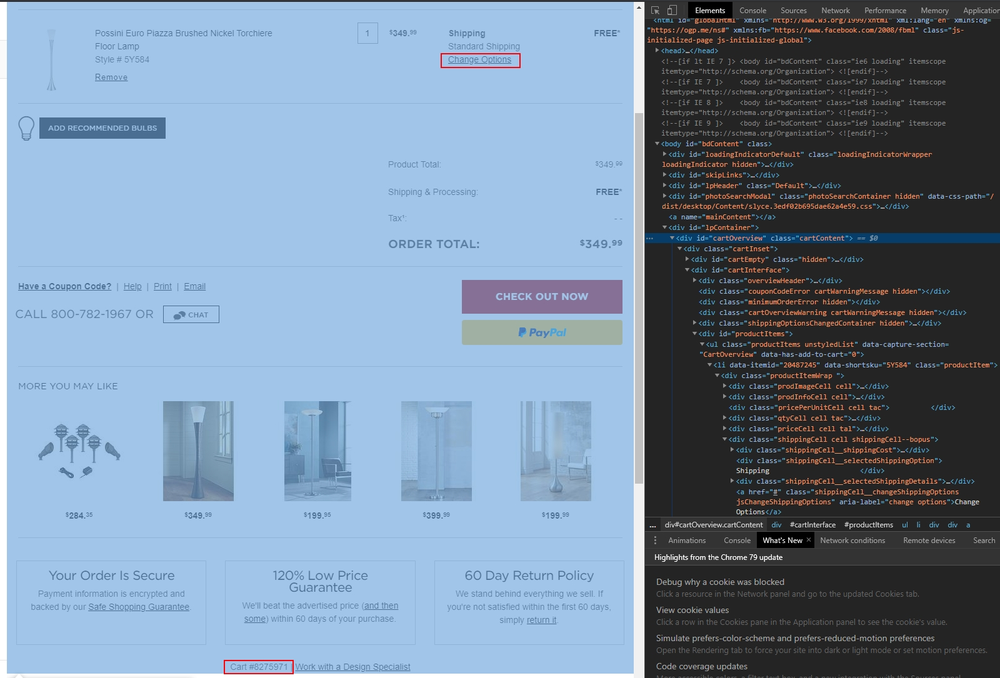

3. Next, a list of elements must be created that can be passed into the method. In this case, there will be two elements in the list: the Change Options link and the CartId. These must be declared as variables and then added to the list. 

4. Finally, the list itself must be passed into the **Applitools.CaptureScreenWithIgnoreElements()** method. Below is an example of declaring the regionElement, the IElement variables for the list and the list itself being used:

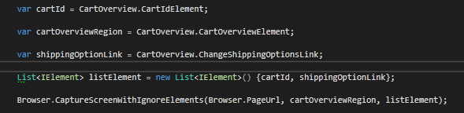

5. After executing the test, check in Applitools for the results. In this case, the two elements defined for the list should be outlined in blue which is indicative that they have been ignored:

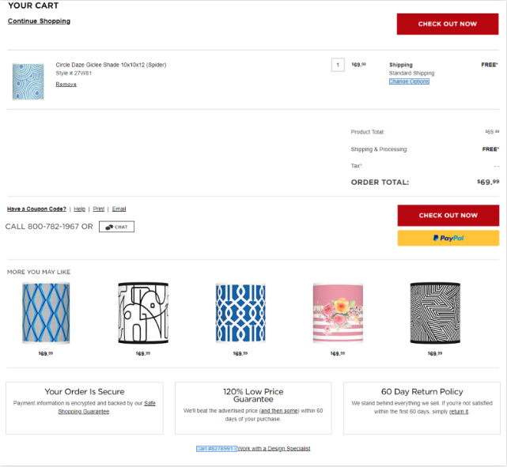

**NOTE:** Using this method can be quite tricky in the sense that the person implementing it must pay close attention to _where_ it's being used in the test script. In the example above, the ignored elements screenshot must be done **FIRST** immediately after navigating to the cart overview page. If the user waits until later in the test after the shipping modal has been open and closed, it causes the "Change Options" link to become a stale element. As such, Selenium can no longer find it and the test will fail every time. Be conscious of the actions on the page before using the Applitools.CaptureScreenWithIgnoreElements() method.

### Using Common Data In A Test

Originally, the framework was designed to use SQL queries that would select a random item each time the test was executed. While this is desirable for regular regression tests, it is very problematic for visualization tests. If a different SKU is selected for each test, the data will never match to the baseline and the test will always fail causing a plethora of false positives. Fortunately, the framework has a way to deal with this situation by using a **class fixture**. By placing any code that retreives data needed across multiple tests inside the constructor of the fixture class, the main test class has access to the same data during repeated executions. This is particular useful for finding SKUs in the database.

So, for example, if a test needs to have the same SKU, the query will be executed inside the constructor of the fixture class, instead of the main test class. Below is an example on how to accomplish this.

1. Create a public class with the naming convention "\<Type of shared data>\_Fixture". ShortSkus will be the most common sought after data so the class should be named "**SharedSku_Fixture**". 

   The class should inherit from "**FixtureBase**. Set a public property with the necessary type as a getter. Inside the actual constructor, set a variable to the necessary query in ProductActions. If a SKU is the common data desired, it is recommended to call the variable '**ShortSku**':

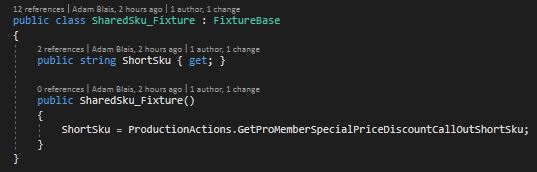

2. Next, in the main test class, as mentioned in the section "**Inheritance In A Visual Test**", inherit from '**VisualTestsBase**' and the class fixture interface. This time, however, the '**\<TFixture>**' value of the interface will be whatever the fixture class name was from Step 1. 

   Add a protected readonly field called '**Fixture**' for the fixture class created in Step 1.

    Finally, in the constructor, add a reference to the fixture class with the parameter '**fixture**'. The '**base**' must also reference the 'fixture' parameter. In the code block of the constructor, add the field and parameter '**Fixture = fixture**':

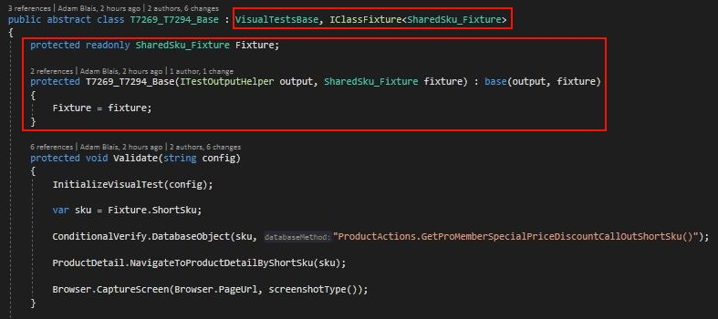

   Please note that even though the query was called in the class fixture, the ConditionalVerify to confirm the query returned a result is still located within the **main test class**.

3. Repeat the updates to the constructor **_minus the code block change_** for the **DesktopBase** and **MobileBase**:

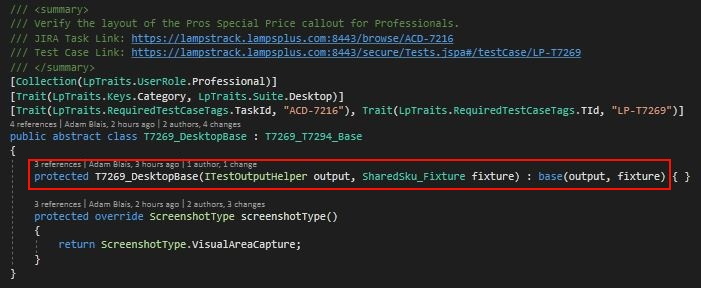

4. Finally, repeat the updates to the constructor **_minus the code block change_** for **EACH** test configuration:

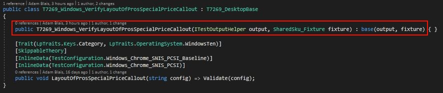
   
Please see test case '**T7269\_T7294\_VerifyLayoutOfProsSpecialPriceCallout.cs**' for the full test class example of the above.

##### Common Accounts

One of the challenges of automation is the issue of concurrency. If two tests are executing at the same time and use the same user account, collisions can occur in the data which consequently invalidates both tests.

Today, this is avoided by decorating test cases that use accounts with the '**Collection**' attribute. This ensures that tests with certain user roles run sequentially instead of in parallel. However, as a long term solution, this is not efficient. Therefore, in the near future a service will be created that will serve out accounts from a pool and then return that account to the pool once a test has finished. 

But much like using random SKUs in a test, using random accounts can also cause issues with visualization testing. Once again, however, the framework has been updated to handle this situation and the solution is even easier than the one for SKUs.

1. In the main test class, once again follow the instructions from the section "**Inheritance In A Visual Test**" and inherit from '**VisualTestsBase**' and the class fixture interface. The '**\<TFixture>**' value of the interface this time will be '**FixtureBase**'. 
 
    In the constructor, add a reference to the '**FixtureBase**' class with a '**fixture**' parameter. The '**base**' will also pass in the 'fixture' parameter:

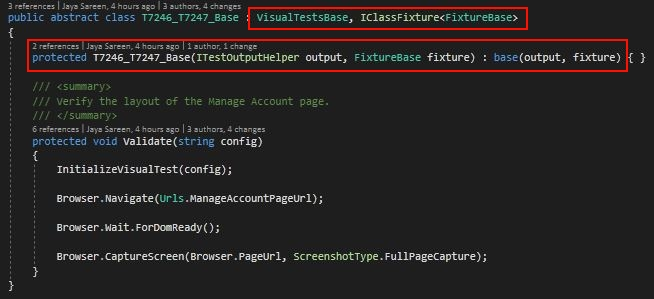

2. For the '**DesktopBase**', '**MobileBase**', and all Test Configurations, update the constructor exactly how it was done for the main test class.

**DesktopBase:**

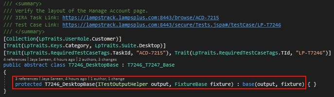

**Test Configuration:**

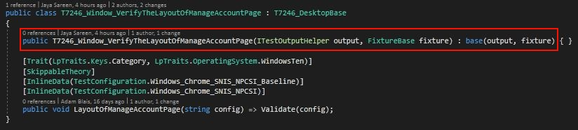

---

### Applitools Integration
Taking screenshots of the Lamps Plus site has no value unless there is some sort of way to compare them to each other and identify what, if anything, has changed between them. Fortunately, Applitools has a tool to do just this.

1. Navigate to https://applitools.com/users/login and login with the appropriate credentials. _NOTE: Developers will need to be set up in the Applitools system prior to using this. Speak to Eilat about acquiring access._
2. Upon a successful login, the user will be directed to the main Applitools dashboard. Before executing a test and checking the result, two important steps must be completed:
  * Click on the person icon in the upper right corner and hover over '**Teams**'. Select the '**Lamps Plus POC**' team:

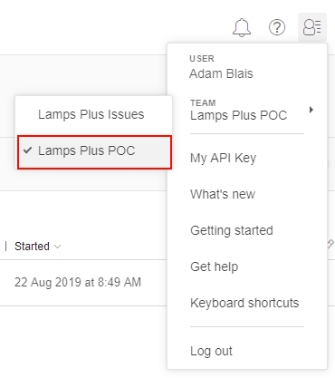

   If this is not done, the user will not be able to see the screenshots that are taken for their test.
   * Next, click on the dropdown in the upper left corner of the screen and select the option '**Branch baselines**':

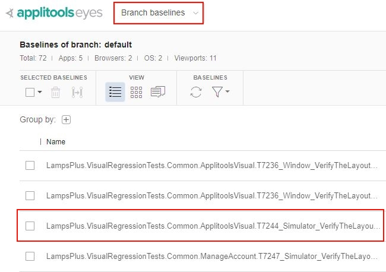
  
   This will show all of the baseline screenshots that have been taken. Ensure that a baseline for the test being executed is **NOT** present in the list. The test case ID (e.g. T7244) is part of each screenshot so if there is a baseline screenshot for the test case that is going to be executed, it **MUST** be deleted and deleted _**each time**_ before the test is executed. If it is not, the new baseline will not be saved - it will continue to use the old baseline saved in Applitools.

So in the screenshot above, if a user is about to test T7244, he/she must delete the highlighted screenshot.

3. Execute the test in Visual Studio.
4. Back in Applitools, from the dropdown in the upper left, select the '**Test results**' option:

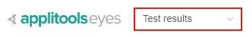

5. Once the page loads, the screenshots will be listed on the left side. There will be TWO screenshots per test, a baseline and the compare. The baseline should always show as '**Passed**'. The second screenshot is the compare and will either also be '**Passed**' or '**Unresolved**':

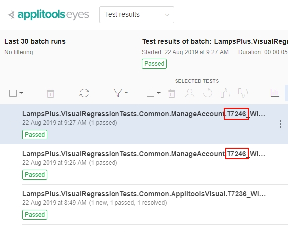

6. Click on either the baseline or compare screenshot in the left hand column (it doesn't matter which). Then click on the test name located under the '**Test**' column:

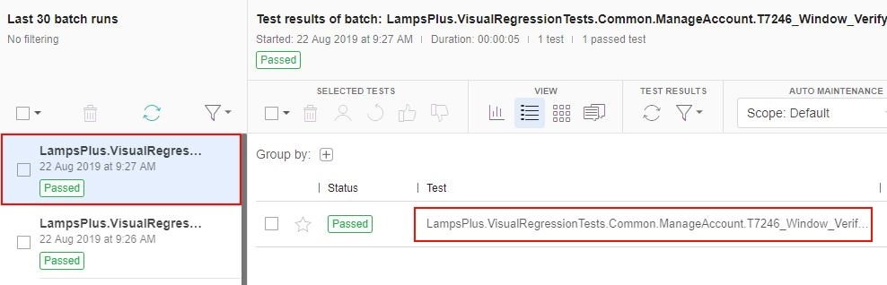

7. Clicking on the test name will show a thumbnail of the screenshot. Click on the thumbnail:

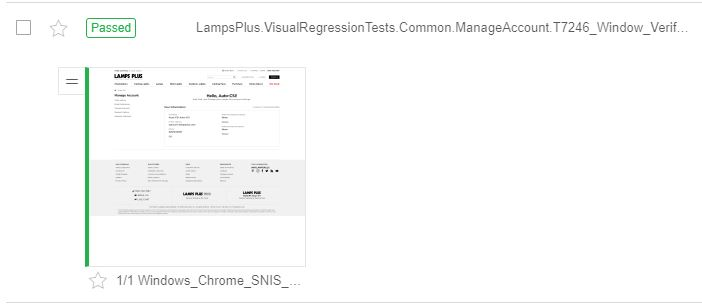

8. A modal window will appear showing the screenshot. In order to show the baseline and compare shot side-by-side, click on the menu in the upper left and select the option '**Show both**':

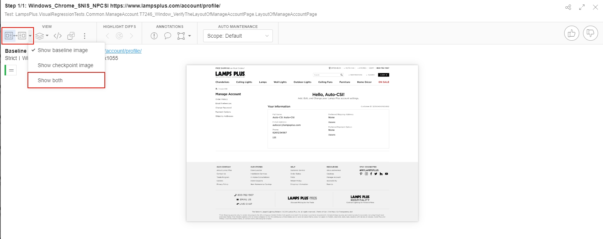

9. The images will now be shown side by side. In the screenshot below, they are both showing as green and there is no highlighting indicating differences so this test is a pass:

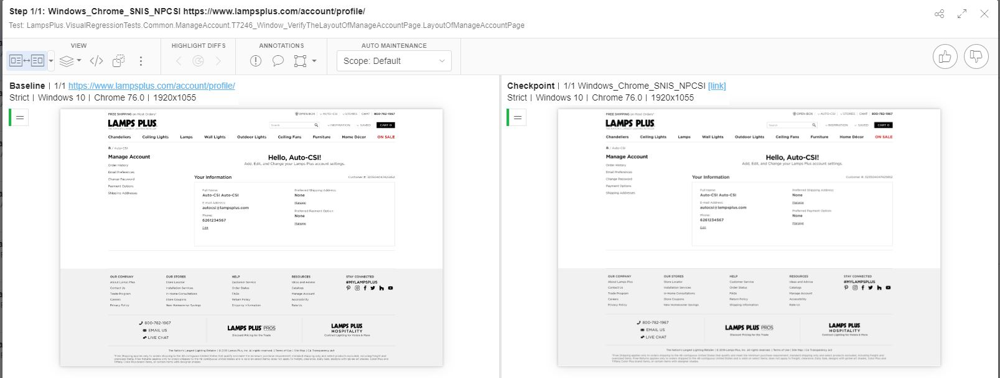

If there are differences between screenshots, these will be highlighted in pink as shown in the example below:

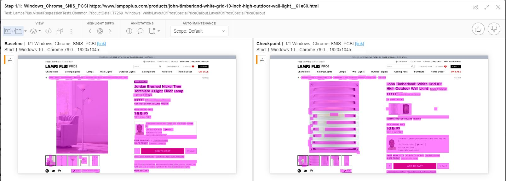
