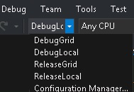

# Build Configurations
The Lamps Plus Web Tests solution uses Build Configurations to automatically configure the project for desired modes of operation.

Build Configurations can be found in Visual Studio

## Supported Build Configurations
The solution currently supports 4 build configurations:
Configurations with Debug in the name support debugging and breakpointing capabilities.
Configurations with Release in the name do not support debugging.
Configurations with Local in the name will execute tests on your local machine.
Configurations with Grid in the name will exectue test remotely on the configured machine.

## Supported Selenium Grid Configurations
Grid testing will execute tests remotely on the configured Selenium Grid.
The currently supported Selenium Grid configuration can be found [here](https://confluence.lampsplus.com:8093/display/TA/Selenium+Grid+Configurations).

## Point to a Different Grid
In the event you need to point to a different grid for specific testing modify the _hubIpAddress field value in the Configure() method [here](../../LampsPlus.Automation.Tests/Utilities/EnvironmentSettings.cs).
Supported IP addresses can be found on the above Confluence page. Only Hubs can be connected to so ensure you check the Notes column and are connecting to a Hub.

NOTE: Please coordinate on the QA Automation Chat before changing the grid you are point to as it may be in use by someone else.
