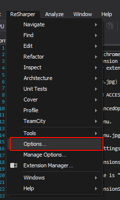
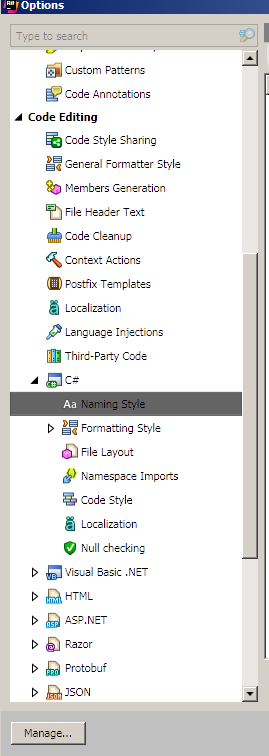
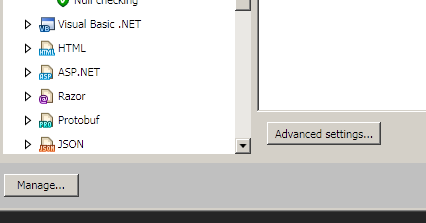
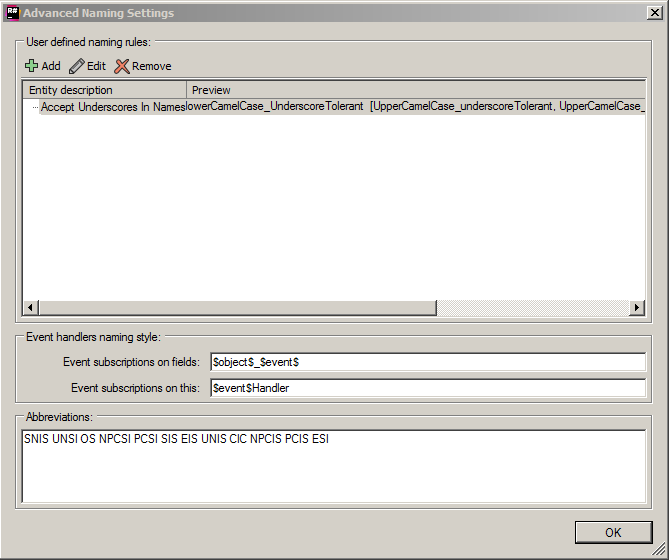
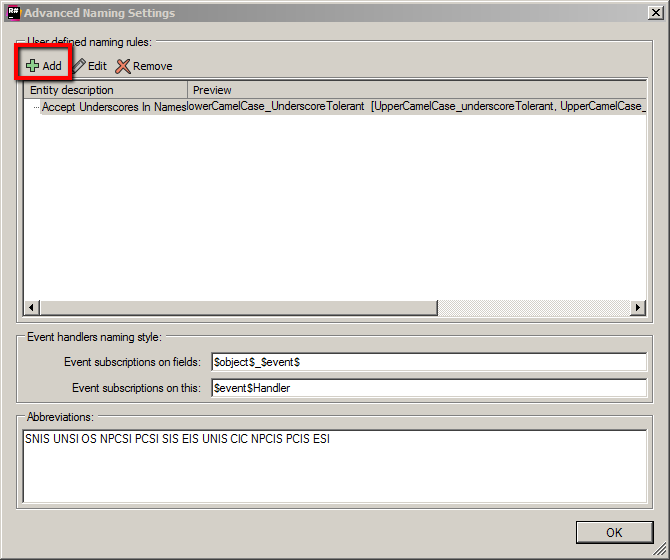
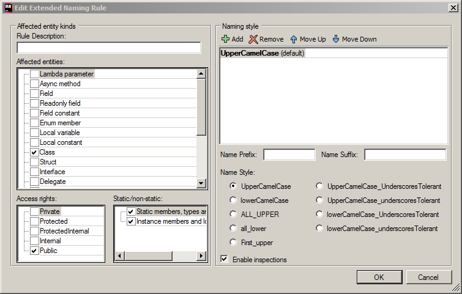
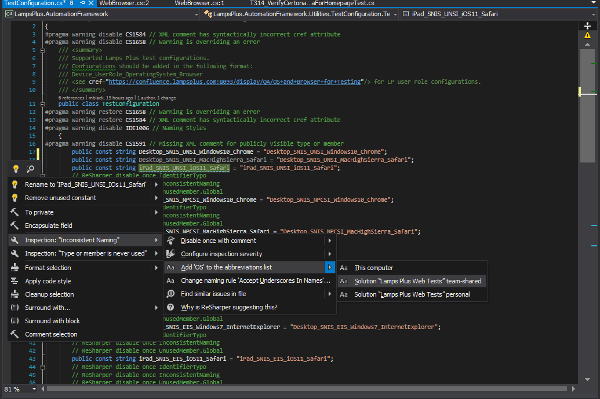

# Configuring ReSharper

There are times where ReSharper will need to be re-configured to accept the current naming conventions that are being used by Lamps Plus in their automation framework. The purpose of this document is to explain how to address common scenarios a developer might run into.

**_PLEASE NOTE: ALL rule changes to ReSharper MUST be approved by the architect team before implementing them._**

 ### Adding A New Naming Convention
 1. In VisualStudio, click on the ReSharper menu and select '**Options**'.
 
 
 
 2. Once the Options menu opens, find the '**Code Editing**' menu and select '**Naming Style**'.
 
 
 
 3. Click on the '**Advanced settings...**' button.
 
 

4. Once the 'Advanced Settings' have been opened, the '**Advanced Naming Settings**' pop-up window should display.

5. Click the '**Add**' button on the window.

6. Clicking the 'Add' button will open the '**Edit Extended Naming Rule**' window
 

7. In the 'Edit Extended Naming Rule' window enter in the following information:
* A name for the rule in the '**Rule Description**' field.
* Select whichever entities the rule will apply to in the '**Affected entities**' field.
* Select the appropriate '**Access rights**'.
* Select whether the rule applies to static or non-static members in the '**Static/non-static**' field.
* Observe the option in the '**Naming style**' field. If the case required is already in the field, then simply click the '**Ok**' button to close the window. Otherwise, select another option from the '**Name Style:**' section below the 'Naming style' field. NOTE: Multiple options can be added to the rule by simply clicking the '**Add**' button at the top of the 'Naming style' field and selecting the appropriate radio button next to the desired 'Naming Style'.
* Ensure the '**Enable inspections**' checkbox is selected.
* Click the '**Ok**' button.

8. Click the '**Ok**' button on the 'Advanced Naming Settings' window to close it.
9. On the ReSharper '**Options**' window select the '**SaveTo**' button and select the option '**Solution "Lamps Plus Web Tests" team-shared**'. Now once the code is committed to the repository, the new ReSharper rules will be propagated to all other team members.

NOTE: For further information regarding this process please see [here](https://www.jetbrains.com/help/resharper/Coding_Assistance__Naming_Style.html)

### Adding Abbreviations

If an abbreviation is being used in a name and ReSharper is complaining, use the following solution:

1. Click the name with the abbreviation and then click the little ReSharper helper icon to open the menu.
2. Select '**Inspection: "Inconsistent Naming"**' then the '**Add <Abbreviation> to the abbreviations list**' menu, and finally the option '**Solution "Lamps Plus Web Tests" team-shared**'.
3. Once the code is committed to the repository, everyone will receive the updated abbreviations list.

