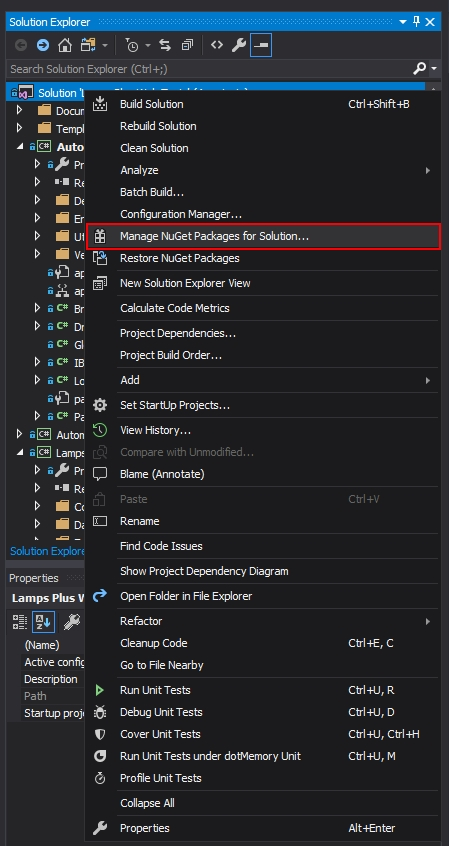
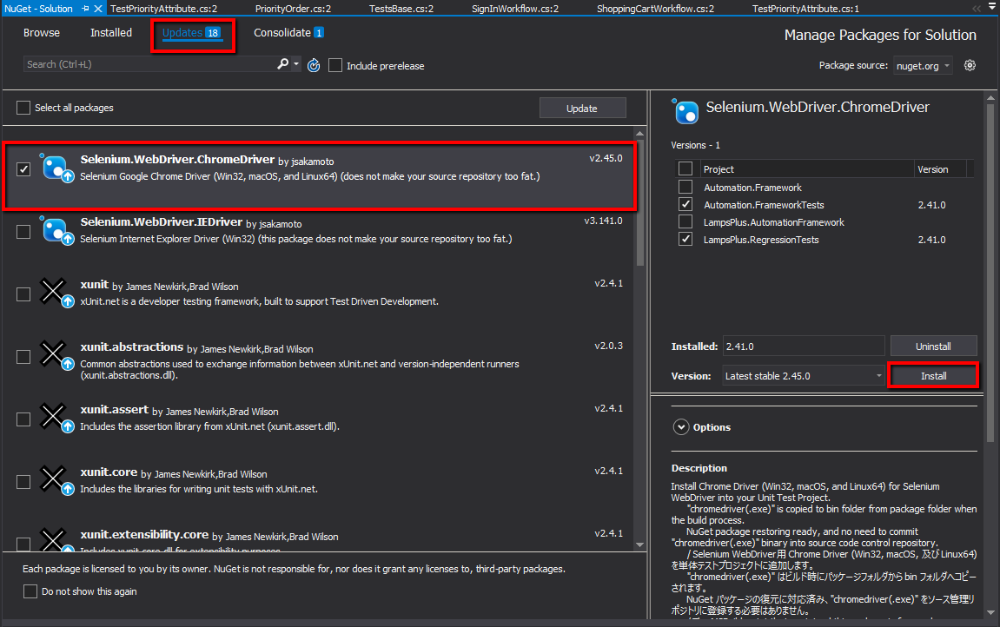
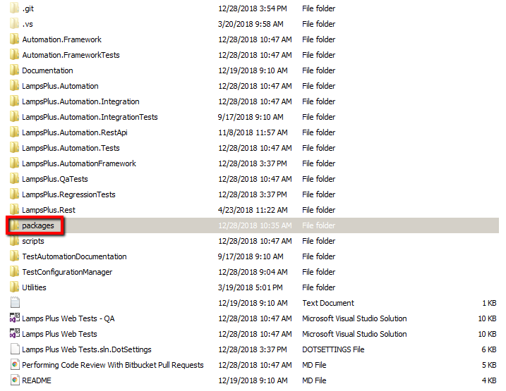
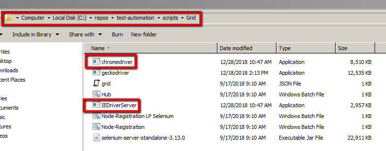

# Configuring the Grid

The purpose of this document is to explain how to update and configure the Selenium grid.

### Updating NuGet Packages
1. In Visual Studio, right click on the solution and select the option '**Manage NuGet Packages for Solution**'.

 
 
2. On the window that appears, select the '**Updates**' option. Select the checkbox next to one of the following:
* Selenium.WebDriver.ChromeDriver
* Selenium.WebDriver.IEDriver

Click on the entire driver to highlight it and then click on the '**Install**' button for the driver. *Take note of the version number being installed.*

 
 
 3. Repeat the previous step for any other web driver that needs updating.
 4. After the installation is complete, on the user's **LOCAL** machine, navigate to the repository and select the '**packages**' folder.
 
  
  
5. Inside the 'packages' folder, identify the web driver folders for the ones that were installed. They will appear as:
* Selenium.WebDriver.ChromeDriver.<VERSION #>
* Selenium.WebDriver.IEDriver.<VERSION #>

Note that the version number at the end of the folder will be the version number observed in Step 2.

6. Drill down into the '**driver**' folder for each web driver until arriving at a .exe for each. The files will be:
* chromedriver.exe
* IEDriverServer.exe

7. Copy each driver .exe into the '**scripts** -> **Grid**' folder. The 'scripts' folder is located at the same folder level as the 'packages' folder.

  
  
8. In Confluence, there is a page that shows all the current Grid machines and their IPs. This is located at: https://confluence.lampsplus.com:8093/display/TA/Selenium+Grid+Configurations
  
  The following Grid machines are the ones that currently would need to be updated with any driver updates:

  * 10.1.14.102
  * 10.1.14.103
  * 10.1.14.104
  * 10.1.14.105
  * 10.1.14.107
  * 10.1.14.108
  * 10.1.14.109

9. Log into each machine and simply copy/paste the '**Grid**' folder from the local directory to each machine.