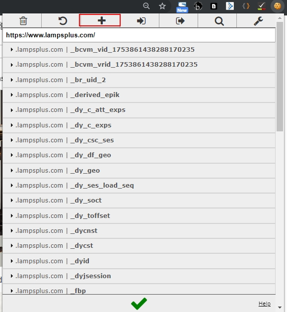
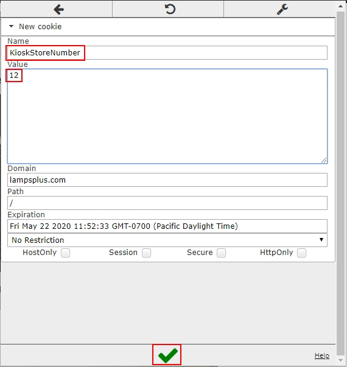
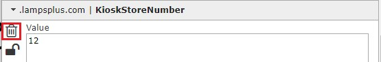

# Using A Cookie to Simulate Store In Session Testing
1. Download the '**EditThisCookie**' extension for Chrome and install it.
2. Click on the cookie icon in the status bar of Chrome to open the extension.
3. Once the extension opens, click on the '**+**' icon to add a new cookie:
 
4. In the dialog box that appears, add the value '**KioskStoreNumber**' in the '**Name**' field, and '**12**' in the '**Value**' field. Click the green checkmark at the bottom of the window when done:

5. You should now see the cookie included in the list of other cookies:

6. Refreshing the page will now initiate Kiosk mode.
7. Click the delete icon in the upper left of the cookie in order to remove it:

8. Refreshing the page will now show the page in normal mode instead of Kiosk. 